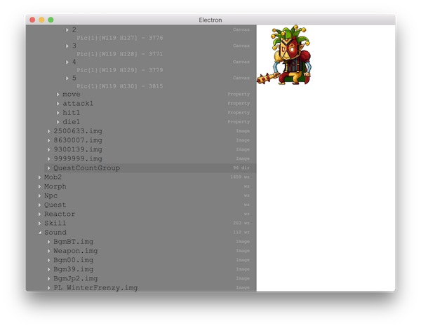

# MapleStory Clone Game Resources module

this is a MapleStory wz extractor using node with `async/await` and providing a server function.

## Usage

```bash
git clone https://github.com/PhilippSchwab/MapleStory-node-resources
cd MapleStory-node-resources
npm install
```

### Parser

```js
const {
  fileclass,
  wz_file,
  wz_image
} = require('./parser')
let MapWz = new wz_file('../origin/Map.wz')
await MapWz.parse()
let Map0img = new wz_image(MapWz.value.dir[0])
await Map0img.extractImg()
```

the whole declaration in `parser/index.d.ts`

### WZ Browser

this repo provide a WZ browser with using electron
first you need put your MapleStory folder with this folder

```bash
cd MapleStory-node-resources
# link or copy MapleStory with this repo folder
#  or you can change Browser.js to change the origin location
ln -s $HOME/Downloads/MapleStory ../origin
npm start electron Browser
```

### Server

this project will provide a server function for the future client, but it hasn't been done.

## Hierarchy
 - [client](./client/index.ts)
 - [server](./server/index.ts)
 - [classify](./classify/index.ts)
 - [pool](./pool/README.md)
 - [parser](./parser/index.d.ts)
